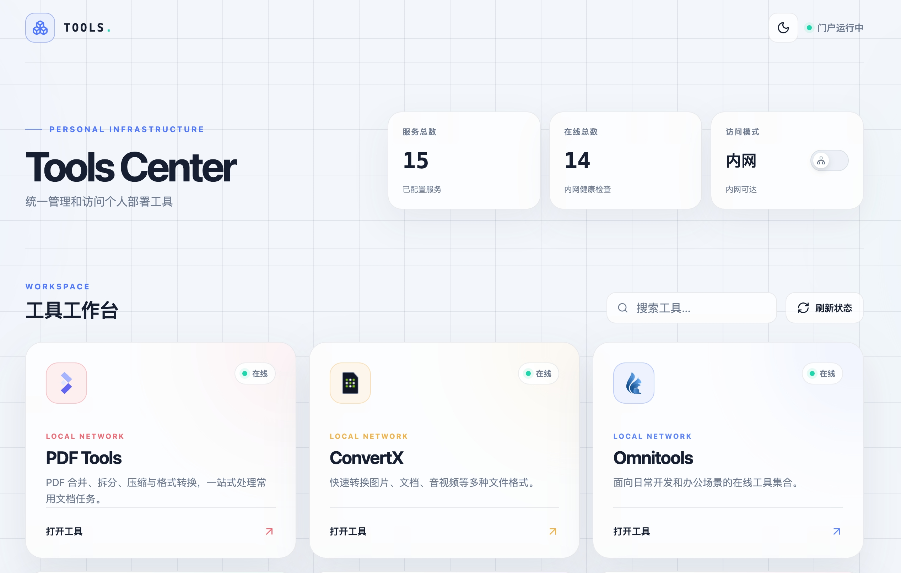

# Docker Tools Center

一个自托管的个人工具导航门户。Vue 3 + Vite + TypeScript 负责界面，NGINX 提供静态资源，Node.js + Fastify 提供配置服务与控制台接口，整体用 Docker Compose 部署。

首页从 `conf.yml` 读取卡片与搜索引擎配置，支持网页搜索、工具筛选、一键刷新全部工具状态，并根据「内网/公网」开关直接跳转到对应地址。控制台可以改配置、管标签和搜索引擎、恢复备份，所有改动都会写回 `conf.yml`。

## 界面预览



> 视觉已向 Apple 页面风格收敛（去掉装饰底纹与光斑、强调色统一为 `#0071e3`），截图待更新。

## 功能

- Apple 风格响应式首屏，支持可配置网页搜索、工具搜索与标签筛选
- 卡片标题、图标、简介、内网地址、公网地址、强调色全部配置化
- 标签注册表 + 工具引用：标签集中定义，首页据此生成筛选条
- 状态聚合探测：前端只发一个请求，后端并发探测、3 秒缓存、在途去重
- 进入首页时自动判断能否访问内网，据此选择内网或公网模式
- 控制台（`#/admin`）：门户信息、工具与标签维护、搜索引擎配置、备份恢复、YAML 直接编辑
- 配置写入回写 `conf.yml`，保留注释与原文件结构；每次写入前自动备份
- 深浅色模式，主题在首屏渲染前就已确定，无闪烁

## 架构

两个容器，职责单一：

```text
浏览器
  │
  ▼
nginx 容器（80）              静态资源 + 反向代理
  ├── /                     → 打包好的前端（hash 路由，无需 SPA fallback）
  ├── /api/config.json      ┐
  ├── /api/health           ├─→ api 容器（3000，不对外映射端口）
  └── /api/admin/*          ┘
                                ├── 读：内存中的配置对象 → JSON
                                └── 写：目录挂载 → 原子写 conf.yml + 备份
```

- **`conf.yml` 是唯一真源。** `/api/config.json` 只是 URL 路径，由 api 在内存中即时序列化，磁盘上不存在这个文件，因此不会出现「YAML 与 JSON 两份状态不一致」。
- 配置目录以**目录**方式挂载（`./config:/etc/docker-tools`）。挂单文件会把 inode 钉住，容器内的原子写（tmp → rename）会失败。
- 写入采用 `fsync(file) → rename → fsync(dir)`，宿主机上的编辑器和容器内进程不会读到写了一半的文件。
- `nginx` 用变量式 `proxy_pass` + Docker 内置 DNS 运行时解析，api 未就绪时 nginx 依然能启动。

## 项目结构

```text
home-dashboard/
├── .env.example                   # 端口与控制台凭据模板
├── config/
│   └── conf.yml                   # 配置真源（v3）
├── data/
│   └── backups/                   # 自动备份，保留最近 20 份（不入库）
├── api/                           # Node.js + Fastify 配置服务
│   ├── src/
│   │   ├── auth/                  # 会话、登录限速
│   │   ├── config/                # schema / 迁移 / 原子写 / 备份 / YAML 读写
│   │   ├── health/                # 探测与聚合快照
│   │   └── routes/                # session / admin / public
│   ├── test/
│   └── Dockerfile
├── frontend/                      # Vue 3 + Vite
│   └── src/
│       ├── components/
│       │   └── admin/             # 控制台外壳、登录页、各面板
│       ├── router/                # hash 路由
│       ├── services/              # 门户与控制台的 API 客户端
│       ├── stores/                # session / config 两个 Pinia store
│       ├── views/                 # HomeView / AdminView
│       └── styles.css
├── nginx/
│   ├── Dockerfile                 # 多阶段：构建前端 → 拷进 nginx 镜像
│   └── nginx.conf
├── docs/design-console-and-refresh.html
└── docker-compose.yml
```

## 快速启动

1. 准备 `.env`：

   ```bash
   cp .env.example .env
   # 生成一个令牌填进 ADMIN_TOKEN
   openssl rand -base64 24
   ```

   `ADMIN_TOKEN` 少于 8 个字符时 api 会拒绝启动。这只是兜底下限，不是强度保证——请用上面的命令生成，不要手写弱口令。

   > 凭据只从 `.env`（或 shell 环境）读取，compose 里没有写死默认值。两项缺任一项 `docker compose` 会**在启动容器之前**直接报错，避免跑出一个空凭据的实例。

2. 建好数据目录并启动：

   ```bash
   mkdir -p data
   docker compose up -d --build
   ```

3. 打开 <http://localhost:8080>。控制台在 <http://localhost:8080/#/admin>。

修改入口端口：

```bash
DASHBOARD_PORT=9000 docker compose up -d --build
```

> `api` 以 `${UID}:${GID}` 身份运行，这样容器写出来的 `conf.yml` 和备份属主还是你，不会变成 root。macOS 上通常不需要额外设置。

## 控制台

- 入口默认隐藏。访问 `/#/admin` 直达；想让首页右上角出现入口按钮，在控制台「概览」里打开**显示控制台入口**（对应 `dashboard.adminEntry`）。
- 登录用 `.env` 里的 `ADMIN_USERNAME` 与 `ADMIN_TOKEN`。会话是 HttpOnly + SameSite=Strict cookie，有效期由 `SESSION_TTL_HOURS` 控制（默认 8 小时）。
- 连续 5 次登录失败会锁定该 IP 15 分钟；登录接口有 300ms 固定延迟，抬高离线爆破成本。
- 管理接口有 60 次/分钟的限流。

「工具」页支持新增、编辑、上下移动（数组顺序即首页顺序）、删除；「标签」页可新建、重命名、删除；「搜索」页可维护首页搜索引擎、启用状态、顺序和默认项；「备份」页可手动留还原点并恢复；「YAML」页把 `conf.yml` 原文（含注释）拉出来直接改。

## 配置

所有用户配置集中在 `config/conf.yml`：

> 仓库中的 IP、端口、域名和图标地址均为示例占位值，部署前请替换为你自己的服务地址。`192.0.2.0/24` 是专用于文档示例的保留网段。

```yaml
version: 3

dashboard:
  title: Tools Center
  description: 统一管理和访问个人部署工具
  adminEntry: false        # 是否在首页右上角显示控制台入口

search:
  defaultEngine: bing
  engines:
    - id: bing
      name: 必应
      urlTemplate: https://www.bing.com/search?q={query}
      enabled: true

networkTest:
  ip: 192.0.2.10
  port: 8081
  protocol: http
  timeoutMs: 3000

# 标签注册表：工具的 tags 引用这里的 id
tags:
  - id: docs
    label: 文档处理
  - id: media
    label: 影音媒体

tools:
  - id: my-tool
    title: My Tool
    description: 工具用途说明
    icon: https://icons.example.com/my-tool.ico
    internalUrl: http://192.0.2.10:8081
    publicUrl: https://my-tool.example.com
    accent: "#5f86ff"
    enabled: true
    tags:
      - docs
```

### 工具字段

| 字段 | 说明 |
|---|---|
| `id` | 唯一标识，小写字母、数字和连字符。创建后不可修改 |
| `title` | 卡片标题 |
| `description` | 卡片简介 |
| `icon` | 图标图片地址；不校验格式，允许 `/assets/x.svg` 这类相对路径。加载失败时显示占位图标 |
| `internalUrl` | 内网原始地址，同时用于状态探测。必须是 http/https |
| `publicUrl` | 公网原始地址；没有就留空字符串，该工具在公网模式下灰显 |
| `accent` | 卡片强调色，`#RRGGBB` |
| `enabled` | `false` 时显示灰色卡片，不探测也不跳转 |
| `tags` | 引用的标签 id 数组，必须已在 `tags` 中注册，且不得重复 |

### 标签字段

| 字段 | 说明 |
|---|---|
| `id` | 唯一标识，小写字母、数字和连字符，至少 2 个字符 |
| `label` | 在首页筛选条上显示的名称，最多 12 个字符 |
| `color` | 可选，`#RRGGBB` |

### 搜索引擎字段

| 字段 | 说明 |
|---|---|
| `defaultEngine` | 首页首次打开时选中的启用引擎 id |
| `engines[].id` | 唯一标识，小写字母、数字和连字符；创建后不可修改 |
| `engines[].name` | 首页选择器中显示的名称，最多 24 个字符 |
| `engines[].urlTemplate` | `http/https` 搜索地址，必须且只能包含一个 `{query}` |
| `engines[].enabled` | 是否允许在首页选择；默认引擎必须保持启用 |

### networkTest

| 字段 | 说明 |
|---|---|
| `ip` | 用于测试的内网 IP |
| `port` | 用于测试的可访问服务端口，可留空 |
| `protocol` | `http` 或 `https` |
| `timeoutMs` | 探测超时，单位毫秒，范围 500–30000 |

配置校验不通过时 api 仍然会启动，控制台可以进去修，但 `/api/config.json` 会返回 503 并带上具体字段错误——不至于让你连修复入口都没有。

## 接口一览

| 方法 | 路径 | 说明 |
|---|---|---|
| `GET` | `/api/config.json` | 前端读取的配置（由内存生成，不落盘） |
| `GET` | `/api/health` | 全部工具的聚合状态，带 ETag / 304 |
| `GET` | `/api/health/:id` | 单个工具实时探测，用于排查 |
| `POST` | `/api/admin/session` | 登录 |
| `GET` | `/api/admin/session` | 查询当前登录态 |
| `DELETE` | `/api/admin/session` | 退出 |
| `GET`/`PUT` | `/api/admin/config` | 读取 / 整体保存配置 |
| `POST` | `/api/admin/config/validate` | 只校验不落盘，供表单实时提示 |
| `GET` | `/api/admin/config/export` | 导出 `conf.yml` 原文 |
| `POST` | `/api/admin/config/import` | 导入 YAML 覆盖 |
| `POST` | `/api/admin/tools` | 新增工具 |
| `PUT`/`DELETE` | `/api/admin/tools/:id` | 修改 / 删除工具 |
| `PATCH` | `/api/admin/tools/reorder` | 按 id 数组重排 |
| `POST` | `/api/admin/tags` | 新增标签 |
| `PUT`/`DELETE` | `/api/admin/tags/:id` | 修改 / 删除标签（`?force=true` 级联解除引用） |
| `GET`/`POST` | `/api/admin/backups` | 列出 / 手动创建备份 |
| `POST` | `/api/admin/backups/:name/restore` | 恢复备份 |

错误统一为 `{ error: { code, message, details? } }`，`details[].field` 用 `tools[2].internalUrl` 这种路径，前端直接拿它给输入框标红。

## 状态判定规则

状态判定刻意保持改造前 NGINX 的语义：

- **在线**：HTTP 2xx / 3xx，以及 400、401、403、404、405、409、422、429
- **离线**：5xx、其他 4xx（如 408）、连接失败或超时

4xx 算在线是有意为之——很多自托管工具未登录时会返回 401/403，用状态码判断会把它们全判成离线。探测走 `HEAD`，`rejectUnauthorized: false`（内网自签证书很常见，且只探活不传输数据）。

`enabled: false` 的工具固定为 `disabled`，不参与探测。

## 地址选择规则

- 每次打开或刷新首页时「公网模式」初始关闭，并立即探测 `networkTest`。
- 探测成功（能建立连接即算成功，不读状态码）：保持内网模式。
- 探测超时或失败：自动开启公网模式。
- 公网模式关闭：跳转 `internalUrl`；开启：跳转 `publicUrl`。
- 开启公网模式但工具未配置 `publicUrl` 时卡片灰显，点击提示「暂未配置公网地址」。
- 状态始终探测 `internalUrl`，不受公网开关影响。

## 备份与恢复

- 每次保存配置、导入 YAML、恢复备份之前，都会先把当前 `conf.yml` 复制到 `data/backups/`。
- 备份名形如 `conf-20260914-091248.yml`（UTC 时间戳，字典序即时间序），同一秒内多次保存会加序号后缀。
- 只保留最近 20 份。清理只认这个命名规则的文件，你放在该目录里的其他东西不会被误删。
- 恢复前同样会先备份当前配置，所以「恢复错了」还有回头路。

## 当前工具

| 工具 | 内网地址 | 标签 |
|---|---|---|
| PDF Tools | `http://192.0.2.10:8081` | 文档处理 |
| ConvertX | `http://192.0.2.10:8082` | 文档处理 |
| Omnitools | `http://192.0.2.10:8083` | 文档处理 |
| Lama Cleaner | `http://192.0.2.10:8084` | AI 工具 / 影音媒体 |
| FileCodeBox | `http://192.0.2.10:8085` | 文件存储 |
| MusicScraper | `http://192.0.2.10:8086` | 影音媒体 |
| Navidrome | `http://192.0.2.10:8087` | 影音媒体 |
| Lucky | `http://192.0.2.10:8088` | 运维部署 |
| 思源笔记 | `http://192.0.2.10:8089` | 笔记知识 |
| 1Panel | `http://192.0.2.10:8090` | 运维部署 |
| DPanel 面板 | `http://192.0.2.10:8091` | 运维部署 |
| Magic-Resume | `http://192.0.2.10:8092` | 文档处理 |
| Octopus | `http://192.0.2.10:8093` | AI 工具 |
| LitePan | `http://192.0.2.10:8094` | 文件存储 |
| Docker Ports | `http://192.0.2.10:8095` | 运维部署 |

## 本地开发

```bash
# 终端 1：api
cd api && npm install
ADMIN_USERNAME=admin ADMIN_TOKEN=dev-local-token-12345678 \
CONFIG_FILE=../config/conf.yml BACKUP_DIR=../data/backups \
npm run dev

# 终端 2：前端（vite 会把 /api 代理到 http://127.0.0.1:3000）
cd frontend && npm install && npm run dev
```

api 的 `PORT` 默认 3000，`CONFIG_FILE`/`BACKUP_DIR` 默认指向容器内路径，本地跑必须显式覆盖。前端代理目标可用 `VITE_API_TARGET` 改。

```bash
cd api && npm run typecheck && npm test    # 类型检查 + 探测语义回归测试
cd frontend && npx vue-tsc -p tsconfig.app.json
```

## 从旧版本升级

旧版是单容器：根目录 `conf.yml`、NGINX 用 `generate-config.sh` 生成前端配置和健康检查路由，只读挂载。

1. `mkdir -p config data && git mv conf.yml config/conf.yml`（或直接手工移动）。
2. 在 `.env` 里补上 `ADMIN_USERNAME` / `ADMIN_TOKEN`。
3. 旧的 `conf.yml` 不需要手工加 `version`——api 启动时会自动迁移到 v3 并补齐缺省字段，标签注册表可以先留空，之后在控制台里加。
4. `docker compose up -d --build` 重建。

`jq` / `yq` / `generate-config.sh` 这套已全部移除，配置解析与健康检查都归 api 容器。

## HTTPS 注意事项

门户若通过 HTTPS 对外提供服务，跳转 HTTP 内网地址不受「混合内容 iframe」限制，因为这是顶层页面跳转；但浏览器会提示目标工具自身是非安全页面。建议公网地址统一配置 HTTPS。

登录接口会根据 `X-Forwarded-Proto` 判断是否给会话 cookie 加 `Secure`。如果你在门户前面再挂一层反向代理并终止 TLS，记得把该头透传过来。
